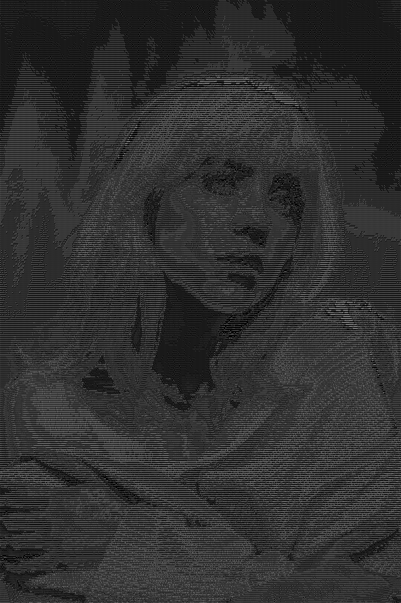

# ASCII Art Generator

Just a little script that turns images into ASCII art.

## What it does
- Converts any image to ASCII art rendering
- Saves as PNG with characters drawn on black background
- Uses complex character density for better detail

## Usage
```bash
python main.py 
```

## Outputs

Creates `ascii_output.png` with your image rendered as ASCII characters.




